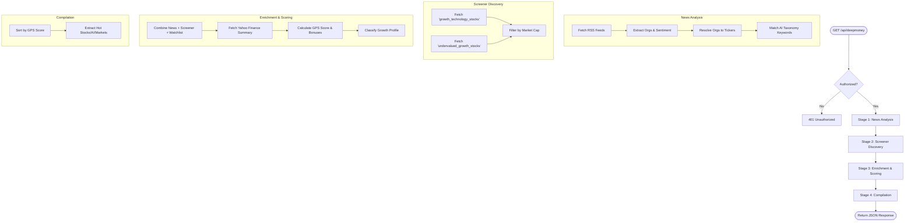

# API Endpoint: /api/deepmoney

The `/api/deepmoney` endpoint is designed for automated AI and Tech stock discovery, analysis, and scoring. It combines real-time news sentiment with fundamental financial data to identify "hot" stocks and sectors.

## 1. Algorithm Overview

The endpoint follows a four-stage process to arrive at its recommendations.

### Stage 1: News Aggregation & Sentiment Analysis
*   **RSS Feeds**: Fetches latest headlines from Yahoo Finance RSS feeds for major indices (DJI, S&P 500, Nasdaq).
*   **NLP Processing**: Uses the `compromise` library to extract organizations (potential companies) from news titles and content.
*   **Sentiment Analysis**: Uses the `sentiment` library to assign a sentiment score to each article.
*   **Ticker Resolution**: Matches extracted organization names to stock tickers using a pre-defined mapping (`company_tickers.json`).
*   **Taxonomy Matching**: Scans news text for keywords related to AI sub-sectors (e.g., "Generative AI", "Semiconductors", "Cybersecurity").

### Stage 2: Dynamic Screener Discovery
*   Queries Yahoo Finance screeners for predefined categories:
    *   `growth_technology_stocks`
    *   `undervalued_growth_stocks`
*   Filters results based on market cap thresholds ($150M to $50B).

### Stage 3: Enrichment & Scoring (GPS)
*   Combines tickers from News, Screeners, and a local AI Tech Watchlist.
*   For each candidate (up to 40), it fetches a full `quoteSummary` from Yahoo Finance.
*   **GPS (Growth, Performance, Sentiment) Score Calculation**:
    *   **Analyst Upside (25%)**: Ratio of target price to current price.
    *   **Revenue Growth (20%)**: Year-over-year revenue growth.
    *   **EPS Growth (15%)**: Growth in Earnings Per Share.
    *   **Momentum (15%)**: 52-week price change.
    *   **Mentions (15%)**: Frequency of the company in recent news.
    *   **Sentiment (10%)**: Average sentiment of news mentions.
*   **Bonuses**:
    *   AI/Tech Hyper-growth profile bonus: +8 pts.
    *   Sub-sector sentiment matches: +4 pts per sector.
    *   High R&D spend (>= 20%): +3 pts.
    *   Small-cap bonus (< $5B): +3 pts.
    *   Keyword Density (>= 5): +4 pts.

### Stage 4: Final Results Compilation
*   Sorts and filters the results into four distinct categories.

---

## 2. Selection Criteria

### Candidate Selection (The "Hard Gates")
To even be considered for any "Hot" list, a stock must pass these initial filters:
1.  **Price Cap**: Must be under **$150.00**.
2.  **Market Cap**: Must be between **$150M** and **$50B**.
3.  **Watchlist Restriction**: If a stock is from the manual watchlist and its market cap exceeds **$10B**, it is excluded to focus on growth.

### Category Logic
| Category | Criteria | Sorting | Limit |
| :--- | :--- | :--- | :--- |
| **Hot Stocks** | Any valid candidate passing the hard gates. | Top GPS Score | 5 |
| **Hot AI/Tech Stocks** | Must meet ONE of: <br>1. Classified as `ai_tech_hyper_growth`<br>2. Has AI sub-sector matches<br>3. Discovered via Tech Screener | Top GPS Score | 3 |
| **Hot Markets** | Broad industries (Gold, Energy, Tech, etc.) found in news. | Top Average Sentiment | 2 |
| **Hot AI Sectors** | AI sub-sectors (Semiconductors, Robotics, etc.) found in news. | Top Average Sentiment | 2 |

### Growth Classifications
The algorithm assigns a classification label based on fundamentals:
*   **AI/Tech Hyper-Growth**: Sector is Tech/Comms AND Revenue Growth >= 20% AND Gross Margin >= 50% AND R&D Spend >= 10%.
*   **Established Growth**: Revenue Growth >= 10% AND EPS Growth > 0 AND 52-Week Change >= 10%.
*   **Up and Coming Stable**: Revenue Growth >= 15% AND Market Cap between $300M - $10B AND Analyst Upside >= 15%.

---

## 3. Network Calls

| Target | Purpose | Frequency |
| :--- | :--- | :--- |
| `finance.yahoo.com/rss/2.0/...` | Fetch market news (DJI, GSPC, IXIC) | 3 calls |
| Yahoo Finance Screener API | Get growth and tech stock lists | 2 calls |
| Yahoo Finance Quote Summary API | Fetch financial metrics for each candidate | ~40 calls |

---

## 4. Sample JSON Response

```json
{
  "hot_stocks": [
    {
      "ticker": "NVDA",
      "company_name": "NVIDIA Corporation",
      "current_price": 135.5,
      "gps_score": 94.2,
      "classification": "ai_tech_hyper_growth",
      "sub_sectors": ["Semiconductors", "Artificial Intelligence"],
      "analyst_upside_pct": 12.5,
      "revenue_growth_yoy": 262.1,
      "gross_margin_pct": 78.4,
      "rd_spend_pct": 14.2,
      "market_cap_m": 3300000.0,
      "mention_count": 12,
      "discovery_source": "screener+keyword",
      "snapshot_date": "2024-05-20"
    }
  ],
  "hot_ai_tech_stocks": [
    {
      "ticker": "ARM",
      "company_name": "Arm Holdings plc",
      "current_price": 120.0,
      "gps_score": 88.5,
      "classification": "ai_tech_hyper_growth",
      "sub_sectors": ["Semiconductors"],
      "analyst_upside_pct": 5.2,
      "revenue_growth_yoy": 47.0,
      "gross_margin_pct": 95.0,
      "rd_spend_pct": 42.0,
      "market_cap_m": 125000.0,
      "mention_count": 4,
      "discovery_source": "watchlist+keyword",
      "snapshot_date": "2024-05-20"
    }
  ],
  "hot_markets": [
    {
      "industry": "Tech",
      "average_sentiment": 4.5,
      "count": 25
    }
  ],
  "hot_ai_sectors": [
    {
      "sub_sector": "Semiconductors",
      "average_sentiment": 5.2,
      "article_count": 15
    }
  ]
}
```

---

## 5. Algorithm Flow Chart


